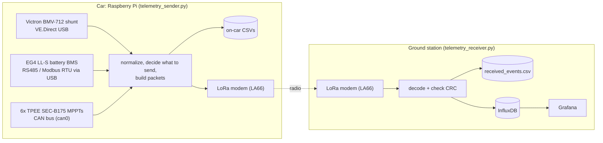

# Solar Car Telemetry

Live telemetry from the solar car to the ground station.

A Raspberry Pi on the car reads three devices and sends compact binary packets over a LoRa radio. A laptop at the ground station receives them and writes them to CSV and InfluxDB, where Grafana displays them.



| Source | Hardware | Connection to the Pi | Code | Telemetry device_id |
|---|---|---|---|---|
| `bmv` | Victron BMV-712 battery shunt | VE.Direct USB cable | `BMV/` | 1 |
| `bms` | EG4 LL-S battery BMS | Battery RJ45 RS485 port → USB-RS485 adapter (Modbus RTU, 9600 8N1) | `BMS/` | 20 |
| `can` | 6× TPEE SEC-B175 MPPTs | CAN bus through an MCP2515 CAN hat (SocketCAN `can0`) | `CAN/` | 1–6 (one per board) |

> **Update the car and the ground station together.** Both ends use the packet format in `telemetry_packet.py`. The receiver rejects packets whose protocol version doesn't match its own (currently **v3**).

---

## Repository layout

```
telemetry_sender.py      On-car entry point: reads the devices, decides what to send, drives the LoRa modem
telemetry_receiver.py    Ground-station entry point: receives, decodes, writes to CSV + InfluxDB
telemetry_packet.py      Binary wire format (header, per-device field layouts, CRC, batching)
transmit_policy.py       Change/heartbeat send policy shared by the MPPT and BMS streams

BMV/   bmv_reader.py      VE.Direct text protocol reader (checksum-verified)
       bmv_normalizer.py  Raw VE.Direct keys -> named fields
       bmv_policy.py      BMV send policy (alarms, SOC changes, deltas, heartbeat)
       bmv_handler.py     Receiver console formatter

BMS/   bms_reader.py      Modbus RTU client for the EG4 battery (pyserial only)
       bms_normalizer.py  Register map + decoding (SOC, cells, temps, flags)
       bms_probe.py       Bench tool: find the battery's address and dump/decode its registers
       bms_handler.py     Receiver console formatter

CAN/   can_reader.py      SocketCAN reader with kernel-level ID filtering
       can_normalizer.py  TPEE Open-SEC frame decoding + list of MPPT IDs
       can_handler.py     Receiver console formatter

LORA/  lora_transport.py  AT-command driver for the LA66 LoRa modem
       radio_config.py    Radio settings shared by every sender and receiver
       sender.py          Test tool: send one text/hex message
       reciever.py        Test tool: run the receiver

storage/ csv_sink.py        On-car CSV logging (one file per device)
         event_csv_sink.py  Ground-station CSV logging (all packet types in one file)

GrafanaScript.JSON       Grafana dashboard
packaging/pyinstaller/   Scripts that build standalone executables
```

---

## Install

On both the Pi and the ground-station machine:
```bash
python3 -m pip install -r requirements.txt
```
The requirements are `pyserial`, `python-can`, `influxdb-client` and `pyinstaller`.

Your user needs access to the USB serial ports (Linux):
```bash
sudo usermod -aG dialout $USER     # then log out and back in
```

**Always use `/dev/serial/by-id/...` paths**, not `/dev/ttyUSB0`. The Pi has three USB-serial devices (BMV, RS485 adapter, LoRa modem), and their `ttyUSB` numbers can swap between boots. To list them:
```bash
ls -l /dev/serial/by-id/
```

---

## Hardware setup (on the car)

### BMV-712 (VE.Direct)
Plug in the Victron VE.Direct USB cable. The default port in `telemetry_sender.py` (`DEFAULT_BMV_PORT`) is the team's cable; change it or pass `--bmv-port` if you use a different cable. The baud rate is 19200.

### EG4 LL-S battery (RS485 / Modbus)
1. **Wiring.** Connect the battery's RS485 RJ45 port to a USB-RS485 adapter.
   - Take the A/B (and GND) pins from the EG4 manual's pinout for the RS485 port.
   - **If A and B are swapped, the battery never answers.** Swapping them causes no damage, so it's the first thing to try.
2. **Address.** The battery's DIP switches set its Modbus address. A single battery is normally 1. Pass it as `--bms-address`.
3. **Port.** The team's FTDI FT232R adapter is the default (`DEFAULT_BMS_PORT` in `telemetry_sender.py`): `/dev/serial/by-id/usb-FTDI_FT232R_USB_UART_A994Y1KM-if00-port0`. It works in any USB port. If you swap in a different adapter, find its path with `ls /dev/serial/by-id/` and update `DEFAULT_BMS_PORT` or pass `--bms-port`.
4. **Verify the register map before trusting the data.** EG4 doesn't publish the map in `BMS/bms_normalizer.py`; it comes from community drivers.
   ```bash
   python3 -m BMS.bms_probe --scan         # which address answers?
   python3 -m BMS.bms_probe --address 1    # raw dump + decoded values
   ```
   The probe uses the same adapter as the sender by default. Add `--port COM5` (or another path) to use a different one:
   ```bash
   python3 -m BMS.bms_probe --port COM5 --scan
   ```
   - Compare the decoded SOC, pack voltage and cell voltages with the battery's display or the EG4 app. If a value is in the wrong place, edit the `REG` table in `BMS/bms_normalizer.py`.
   - If discharge shows as a **positive** current, set `CURRENT_SIGN = -1`. The rest of the system expects discharge to be negative.
   - While running, the normalizer warns in the log if SOC reads over 100 % or the sum of the cells differs from the pack voltage by more than 1 V. Either warning means the register map is wrong.

### MPPTs (CAN bus)
1. Enable the MCP2515 CAN hat in `/boot/firmware/config.txt`:
   ```
   dtparam=spi=on
   dtoverlay=mcp2515-can0,oscillator=12000000,interrupt=25
   ```
2. Bring the bus up after each boot (125 kbps is the TPEE default):
   ```bash
   sudo ip link set can0 up type can bitrate 125000
   sudo ifconfig can0 txqueuelen 1000
   ```
3. **List the MPPTs** in `MPPT_EFFECTIVE_IDS` at the top of `CAN/can_normalizer.py`.
   - Each board's CAN ID is `(effective_id << 4) | packet_id`. Run `candump can0`, then shift each frame ID right 4 bits to get the board's ID (e.g. `0x110 >> 4 = 17`).
   - The order of the list sets each board's `mppt_index` (0, 1, 2, ...) and its device_id (1 + index).
   - Frames from IDs not in the list are dropped by the kernel filter.

---

## Running

### Sender (car)
```bash
python3 telemetry_sender.py
```
By default (`--device all`) it opens every device it can find and skips any whose hardware is missing, logging why. To run one device on its own:
```bash
python3 telemetry_sender.py --device bmv
python3 telemetry_sender.py --device bms --bms-address 1
python3 telemetry_sender.py --device can
```
To read the hardware and print the packets instead of transmitting (no radio needed):
```bash
python3 telemetry_sender.py --device bms --dry-run
```
The sender writes these CSVs in its working directory: `bmv_data.csv`, `bms_data.csv` (includes all 16 cell voltages) and `mppt_data.csv`. If an existing CSV has an older column layout, it's renamed to `*.old-<time>.csv` rather than appended to.

Every 5 s the sender prints a health line for each device, for example:
```
[bms-reader] alive: 5 ok, 0 failed polls in last 5s
[bmv] tx stats: 12 ok, 0 failed in last 5s
```

### Receiver (ground station)
```bash
python3 telemetry_receiver.py --port /dev/tty.usbserial-0001     # macOS/Linux
python3 telemetry_receiver.py --port COM4                        # Windows (default)
```
Each packet is printed, for example:
```
[rx:bms] SOC=87% event=DELTA_UPDATE device=20 seq=7 ...
```
If packets are lost, the receiver prints a `seq gap` line with the running loss percentage for the session.

Useful receiver flags:
- `--show-raw`: prints the raw modem lines.
- `--no-influx-enable`: CSV only.
- `--csv-path`: sets the CSV location (default `received_events.csv`).

---

## How the sender decides what to send

LoRa airtime is limited, so readings are **not** all sent. Each device keeps a cache of its latest reading. A send thread checks that cache and transmits when one of these is true:

- **a value changed enough** (DELTA_UPDATE, or ALARM / THRESHOLD_CROSSING for the BMV), or
- **the heartbeat is due**: nothing changed, but a refresh is sent anyway.

| Device | Sends when... | Heartbeat |
|---|---|---|
| BMV | voltage ±50 mV, current ±200 mA, power ±10 W, SOC changes by a whole percent, or a new alarm | 3 s |
| BMS | **SOC ±1 %**, voltage ±0.2 V, current ±1 A, highest/lowest cell ±10 mV, or any warning/protection/error flag change | 10 s |
| MPPT | PV voltage ±2 V, PV current ±0.5 A, PV power ±1 W, battery voltage ±1 V; status frames at most every 5 s per board | 5 s |

All thresholds can be changed with command-line flags (`python3 telemetry_sender.py --help`).

Other behaviour:
- **Priority on the shared modem:** BMV, then BMS, then MPPTs. A waiting BMV packet always goes out next, ahead of queued MPPT packets.
- **MPPT batching:** up to 4 MPPT packets ride in one radio frame, which costs one modem command instead of four.
- **Peak current is never lost:** the BMV packet carries `peak_current_ma`, the deepest discharge seen since the last BMV packet that got through.
- **Drive timer (`elapsed_s`):** starts the first time the BMV or BMS sees more than 0.5 A of discharge (`--drive-start-current-a`) and counts until the sender stops. It is sent on BMV and BMS packets.
- **Failed sends are retried:** a reading counts as sent only after the modem accepts it. A failed packet still shows up at the receiver as a seq gap.

---

## Packet format (`telemetry_packet.py`)

```
header (14 bytes, big-endian)
  u8 version (=3) | u8 msg_type (1=BMV 2=MPPT 3=BMS) | u8 event_type | u8 device_id
  u16 seq | u32 timestamp (unix s) | u16 field_mask
payload   only the fields whose bit is set in field_mask, packed per the device's layout
crc16     2 bytes over header + payload
```
- A **batch frame** (`0xB5 | count | (len | packet)...`) carries several packets in one radio frame. Each packet inside keeps its own CRC.
- Values are scaled to integers on the wire (for example BMS voltage ×100). The receiver undoes the scaling. BMV voltage and current go out in mV and mA and arrive at the receiver in V and A.

Fields carried over the radio:

| Device | Fields |
|---|---|
| BMV | voltage_mv, current_ma, power_w, charge_state (SOC %), alarm, elapsed_s, peak_current_ma |
| BMS | battery_voltage_v, battery_current_a, soc_pct, soh_pct, cell_v_max_mv, cell_v_min_mv, cell_max_idx, cell_min_idx, cell_sum_v, temp_max_c, temp_avg_c, remaining_ah, warning_flags, protection_flags, error_code, elapsed_s |
| MPPT | pv_voltage_v, pv_current_a, pv_power_w, battery_voltage_v, battery_current_a, mode, fault, enabled, ambient_temp_c, heatsink_temp_c, mppt_index, packet_id |

If you add or change a field, update its layout in `telemetry_packet.py` and bump `PROTOCOL_VERSION`. Then deploy to both ends.

---

## InfluxDB and Grafana

The receiver writes every packet to InfluxDB (v2) under the measurement `telemetry`.
- **Tags:** `msg_type` (BMV/MPPT/BMS), `device_id`, `source`, `port`. Each MPPT board has its own `device_id` (1–6), which is how the dashboard tells the boards apart.
- **Fields:** the packet fields prefixed with `fields_` (e.g. `fields_soc_pct`, `fields_pv_power_w`, `fields_mppt_index`), plus `seq`, `timestamp` and the other header values.

| Setting | Flag | Environment variable | Default |
|---|---|---|---|
| URL | `--influx-url` | `INFLUX_URL` | `http://localhost:8086` |
| Token | `--influx-token` | `INFLUX_TOKEN` | *(none — required)* |
| Org | `--influx-org` | `INFLUX_ORG` | `my-org` |
| BMV bucket | `--influx-bucket-bmv` | `INFLUX_BUCKET_BMV` | `BMV-data` |
| MPPT bucket | `--influx-bucket-can` | `INFLUX_BUCKET_CAN` | `CAN-data` |
| BMS bucket | `--influx-bucket-bms` | `INFLUX_BUCKET_BMS` | `BMS-data` |
| Other types | `--influx-bucket` | `INFLUX_BUCKET` | `Default-data` |

**Token:** put it in a `.env` file in the directory you run the receiver from. The file is git-ignored.
```
INFLUX_TOKEN=your-token-here
```
An older commit had a token hard-coded in `telemetry_receiver.py`, so it is still in git history. **Rotate that token.**

InfluxDB writes run on a background thread. If InfluxDB is slow or down, the receiver keeps receiving and `received_events.csv` still records everything.

Import `GrafanaScript.JSON` into Grafana for the team dashboard. The dashboard doesn't have BMS panels yet; add them from the `BMS` `msg_type` (for example `fields_soc_pct`).

---

## Radio settings

Both ends must use the same frequency, bandwidth, spreading factor, CRC and related settings, or no packets get through. The defaults are in one file, `LORA/radio_config.py` (868.1 MHz, BW 500 kHz, SF7, CRC on), and every script uses them. Change them there rather than with command-line flags, so the two ends can't drift apart.

To test the link without any car hardware, start the receiver and then run:
```bash
python3 LORA/sender.py --port /dev/serial/by-id/<lora-modem> --text hello
```

---

## Troubleshooting

| Symptom | Things to check |
|---|---|
| `[bms-reader] ... failed polls, last error: no reply` | A/B wires swapped, wrong `--bms-address`, wrong port, battery off. Run `bms_probe --scan`. |
| `[bms] WARNING: cell sum ... != pack voltage` or `SOC reads 150 %` | The register map is wrong for this battery firmware. Check it with `bms_probe` and fix `REG`. |
| `[bmv-reader] Checksum FAILED` now and then | Electrical noise on the VE.Direct cable; bad blocks are dropped. If it happens constantly, check the cable. |
| `[bmv-reader] Non-tab-delimited line` | Wrong port or baud rate for the BMV. |
| `[all] CAN unavailable, skipping` | `can0` isn't up; run the `ip link` command above. |
| An MPPT never appears | Its ID isn't in `MPPT_EFFECTIVE_IDS`; check `candump can0`. |
| Receiver prints `Unsupported protocol version` | One end wasn't updated; deploy the same code to both. |
| Many `seq gap` lines | Radio range or antenna problems, or mismatched radio settings. |
| `No InfluxDB token provided` | Create `.env` with `INFLUX_TOKEN=...`. |

---

## Build standalone executables

```bash
python3 -m pip install --user pyinstaller
cd packaging/pyinstaller
./build.sh        # or: make
```
The executables `telemetry_sender` and `telemetry_receiver` are written to `dist/` at the repo root. To use a different interpreter, run `PYTHON_BIN=/path/to/python3 ./build.sh`.
